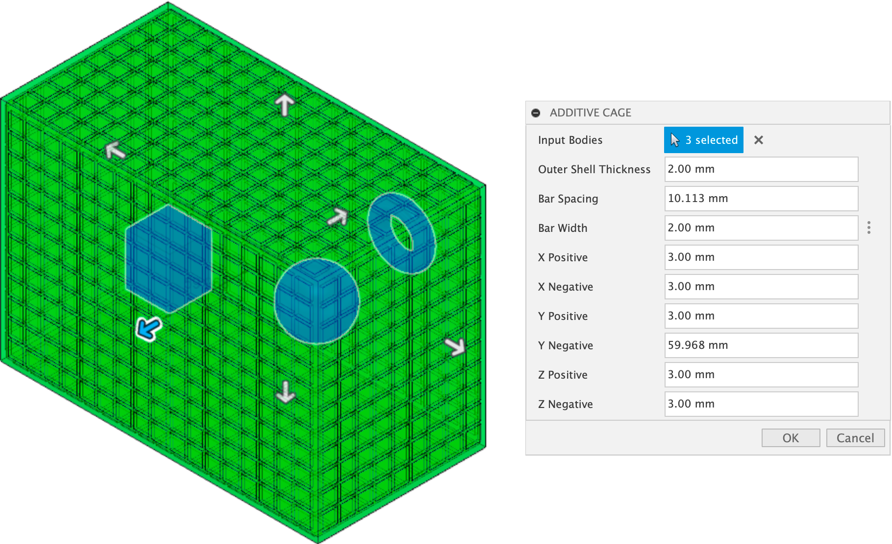

FusionBoxer
===========

Fusion 360 Addin to create a bounding cage for Additive Manufacturing

Usage
-----

Installation
------------

Compatibility
-------------
**This will only work with Fusion 360 Development branch today.  Will be supported with January release of Fusion 360.**

License
-------
`MIT License`_

.. _MIT License: ./LICENSE

Authors
-------

**FusionBoxer** was written by `Patrick Rainsberry <patrick.rainsberry@autodesk.com>`_.
